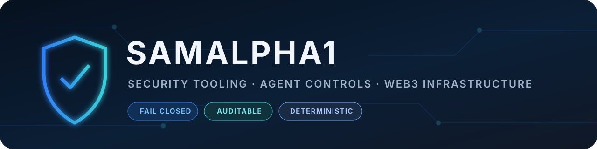

  

  
  

## Security tooling with evidence, not guesswork

I build defensive Python tools for repository security, agent-control boundaries, and Web3 infrastructure. The featured projects are designed around **read-only inspection**, **fail-closed behavior**, **deterministic output**, and **reproducible evidence**.

## Featured work

| Project | Purpose | Evidence |
|---|---|---|
| **[GitHub Trust Auditor](https://github.com/SamAlpha1/GitHubTrustAuditor)** | Audits public GitHub accounts and repositories without executing target code. | [Live scanner](https://samalpha1.github.io/GitHubTrustAuditor/) · CLI · GitHub Action · English/فارسی |
| **[ActionCage](https://github.com/SamAlpha1/ActionCage)** | Deterministic policy firewall for tool calls: allow, review, or deny. | Fail-closed rules · hashed decisions · Python 3.11–3.13 CI |
| **[ProvenanceLint](https://github.com/SamAlpha1/ProvenanceLint)** | Finds risky instruction surfaces and verifies integrity manifests. | Static checks · SARIF/JSON · Python 3.11–3.13 CI |
| **[SideEffectMap](https://github.com/SamAlpha1/SideEffectMap)** | Records what a command actually changed on disk. | Before/after hashes · deterministic reports · Python 3.11–3.13 CI |
| **[EVM Contract Inspector](https://github.com/SamAlpha1/EVMContractInspector)** | Read-only EVM bytecode, proxy, and contract inspection. | No wallet required · JSON output · standard-library Python |
| **[RPC Health Monitor](https://github.com/SamAlpha1/RPCHealthMonitor)** | Measures EVM RPC latency, freshness, and availability. | Stale-block detection · non-zero failure exits · JSON output |

## Engineering principles

- Security-sensitive paths should fail safely.
- Inspection tools should be read-only by default.
- Results should include file-, line-, hash-, or state-level evidence.
- Secrets belong outside source control.
- Featured projects ship with documentation, tests, and GitHub Actions.

## Focus

`Python` · `GitHub Actions` · `Static Analysis` · `CLI Tooling` · `EVM / JSON-RPC` · `Security Automation`

## Connect

For reproducible bug reports or feature ideas, open an issue in the relevant repository.

- **X:** [@samalpha_](https://x.com/samalpha_)
- **Live project:** [GitHub Trust Auditor](https://samalpha1.github.io/GitHubTrustAuditor/)
- **Profile:** [github.com/SamAlpha1](https://github.com/SamAlpha1)

Canonical projects and public history are maintained under <strong>SamAlpha1</strong>.
